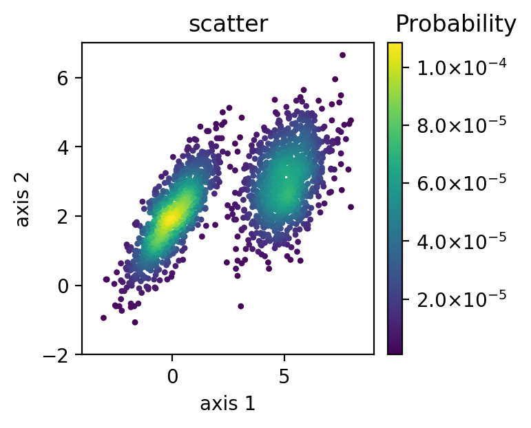

# DensityPlot
A simple and standalone python plotting package for density and scatter plotting commonly used in FACS analysis.

This package was modified from [FlowCal](https://github.com/taborlab/FlowCal) package.

Check [here](./examples/tutorial.ipynb) for a tutorial on usage.
