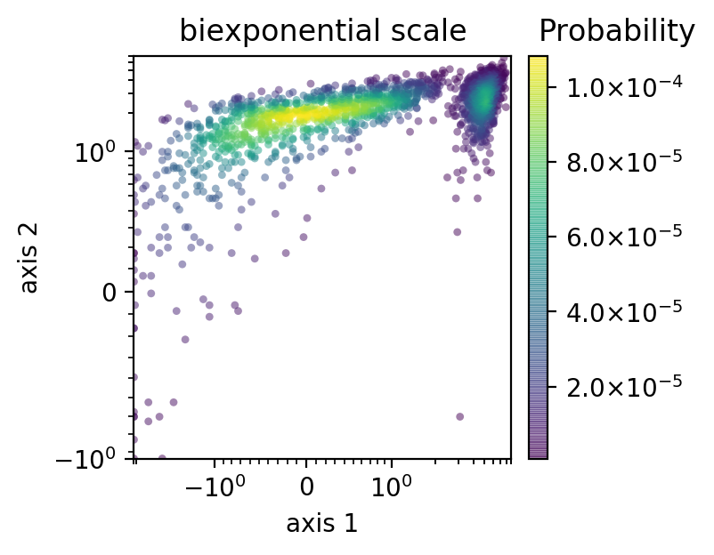
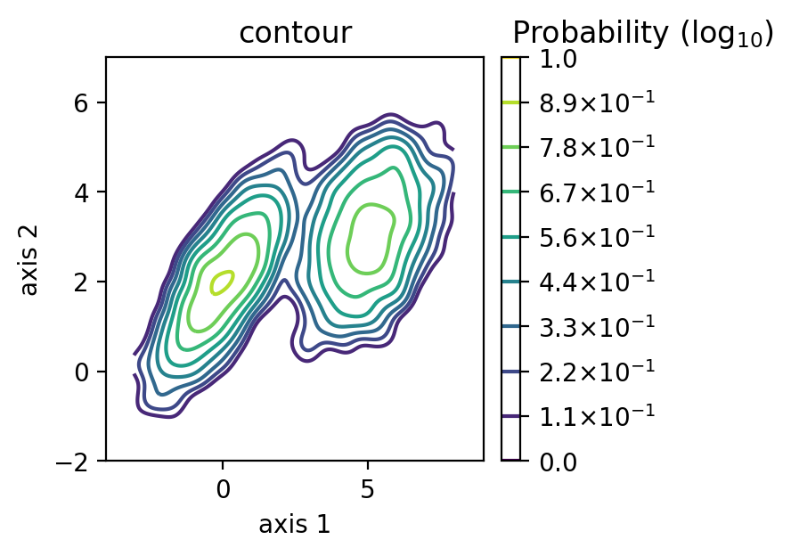

   


# DensityPlot
-------------------

A simple and standalone python plotting package for density and scatter plotting commonly used in FACS analysis.

This package was modified from [FlowCal](https://github.com/taborlab/FlowCal) package.

Check [here](https://nbviewer.jupyter.org/github/xuesoso/DensityPlot/blob/master/tutorial.ipynb) for a tutorial on usage.

Pip installation
-------------------
```bash
pip install DensityPlot
```

Requirement
-------------------
scipy >= 0.14.0

matplotlib >= 2.0.0


Modes available
---------------
scatter : A scatterplot colored by the data density. Dense regions are merged into bins. Sparse region is represented by as single dots.

mesh : 2D-histogram colored by the data density in the region

scatter_mesh : 2D-histogram with original data values plotted as dots.

contour : A contour map of the data density. Recommend setting ```smooth``` option as True.
